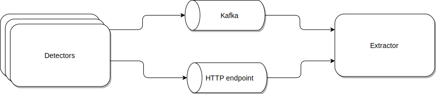

# Integration With Extractor

Sentinel SDK detectors can integrate with the Extractor system through multiple channels, providing flexibility in how events are transmitted and processed. The two primary channels for this integration are Kafka and HTTP Endpoints

## Delivery Events


## Code sample for sending an event toward Extractor

```python
await self.outputs.events.send(
   Event(
       did=f"{self.name}-{token}",
       type="balance_threshold",
       severity=self.severity,
       sid="ext:ad",
       metadata={
           "tx_hash": tx_hash,
           "tx_from": tx_from,
           "tx_to": tx_to,
           "value": tx_value,
           "monitored_contract": addr,
           "desc": f"Balance {token} below threshold ({self.threshold})",
       },
   )
)
```

