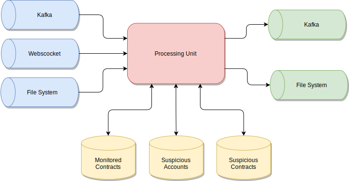

# Sentry Overview

The Sentry is a main processing unit in Sentine SDK. It can operate with external worlds via input/output channels 
and databases.

## The list of Sentry types

- [Core Sentry](CoreSentry.md)
- [Async Core Sentry](AsyncCoreSentry.md)
- [Transaction Detector](TransactionDetector.md)
- [Transaction Block Detector](TransactionBlockDetector.md)

